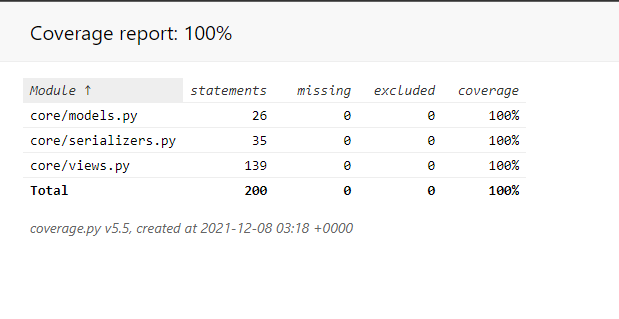
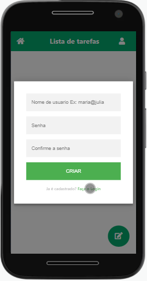

# django-api-rest-lista-de-tarefas
> Uma aplicação web 100% funcional e testada para organizar as tarefas diárias com opção de checkagem para as tarefas que foram completadas. 
Com essa aplicação é possível criar um usuário para fazer o login e criar, editar, excluir e atualizar as suas tarefa diárias.  Acesse essa aplicação cliclando no [link da aplicação](https://app-task-org.herokuapp.com/)

O projeto foi desenvolvido seguindo o conceito Mobile First com foco inicial na arquitetura e desenvolvimento direcionado para dispositívos móveis. O Frontend é modesto. Contando um uma página dinâmica com a alma do javascritp sendo executado através da biblioteca Jquery. Para o consumo da API no frontend, utilizei o AJAx. Como meu foco é o backend, usei Jquery para agilizar o trabalho e deixar a interface simples o bastante para atender as necessidades no consumo da API Rest. Meu objetivo final foi consumir uma API Rest em Django para realizar um CRUD utilizando os principais verbos http(POST, PUT, PATCH, GET, DELETE) e a autênticação via Token.

A API web foi 100% testada seguindo o conceito de testes TDD (Test-Driven Development, ou Desenvolvimento Orientado a Testes). Para automatização dos teste foi utilizado a ferramenta Coverage para analizar o que testar. Para a criação automatizada de objetos foi utilizado a biblioteca model-mommy




Este projeto é o conjunto de 2 aplicões web(APP + API) desenvolvidas usando Django e Django REST framework com validação via token ao acesso à API usando django-rest-knox para agilizar o desenvolvimento e dar mais segurança as requisições feitas à API. O banco de dados utilizado na API é Mysql 5.7

 Acesse essa aplicação cliclando no [link](https://app-task-org.herokuapp.com/)

  


## Instalação de ferramentas para o ambiente de desenvolvimento

Este projeto é 100% Dockerizado. Para executar esse projeto você vai precisar ter docker instalado na sua máquina


## Executar projeto

Tanto para Linux quanto para Mac & Windows você vai executar os seguintes comandos pelo terminal ou cmd dentro do diretório onde se encontra o arquivo _docker-compose.yaml_

Vamos executar o docker-compose para bildar e criar os 3 containers do serviços(db, web_api, web)

```sh
docker-compose up
```

Após a criação dos 3 containers, vamos derrubar esses containers com as teclas de atalho(CTRL + C) no terminal ou cmd e rodar novamente o docker-compse up pois a aplicação mysql pode quebrar no build de criaçao da imagem e execução do container.

Agora precisamos criar as tabelas no banco de dados Mysql no container _api-tarefa_container_. Vamos abrir outro terminal ou cmd dentro do diretório do projeto onde se encontra o arquivo docker-compose.yaml e executar o seguinte comando

```sh
docker exec -it api-tarefa_container python manage.py migrate
```

Agora já podemos acessar nossa aplicação no navegador/Browser e fazer o registro de um usuários para poder logar e criar tarefas. 

Digite o seguinte endereço na url do navegador:
Você deve utilizar esse endereço http://127.0.0.1:8001/ para acessar o aplicativo e nao o http://localhost:8001/


## Utilidade da aplicação

A vantagem dessa aplicação é o fato do usuário poder marcar como completa depois de realizar a tarefa. Isso é util para tarefas que devem seguir uma ordem cronológica ou uma forma de você saber o que você ja executou. Um exemplo disso é uma lista de compras de supermercado. Quando você vai ao supermercado e conta com uma lista que não tem a opção de checagem, acaba se perdendo no que comprou ou não em meio aos produtos no carrinho de compras.

## Ambiente de Desenvolvimento

#### Mac & Windows  
Instalar a ferramenta Docker Desktop - [Docker Desktop](https://www.docker.com/products/docker-desktop)  
 
 
#### Linux
Caso não tenha docker instalado na sua máquina, siga essa [documentação](https://docs.docker.com/engine/install/ubuntu/) do time do Docker para instalação no Linux
 


## Meta

Adriano Robson - [Linkedin](https://www.linkedin.com/in/adriano-robson/)  
Gmail - adriano08andrade@gmail.com  
 
[django-api-rest-lista-de-tarefas](https://github.com/AdrianoRobson/django-api-rest-lista-de-tarefas)
